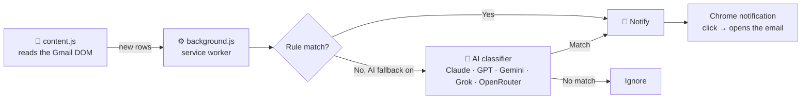

<div align="center">

# 📬 Gmail Category Watcher

**Tell it what kind of email matters. It watches your inbox and pings you the moment one shows up.**

No OAuth. No Google Cloud project. No API dashboard tour. Load it and it works.


</div>

---

> [!IMPORTANT]
> **Requires one Gmail tab to be open** (it doesn't need to be the active/
> focused tab — a pinned background tab is fine). This extension has no
> access to Gmail's servers; it reads the inbox off the page itself, so if
> every Gmail tab is closed, there's nothing for it to read and watching
> pauses until one is open again. If none is open when you flip watching
> on, it opens a pinned one for you automatically — see [Requirements](#requirements).

## The problem this solves

Your inbox has exactly one email you actually need to see today, buried under
forty you don't. Gmail's own filters only understand exact keywords. Zapier/
Make.com want you to wire up a scenario and pay per run. The "proper" way —
the Gmail API — wants an OAuth consent screen, a Google Cloud project, a
verified app, and twenty minutes you don't have.

This skips all of it. It reads your inbox the same way *you* do — off the
rendered page — and decides what's worth a notification using either plain
rules or an AI's judgment call.

## How it works



Nothing here logs in, authenticates, or touches Gmail's servers directly —
`content.js` only ever *reads* the page you're already signed into.

## Features

| | |
|---|---|
| 🚫 **Zero setup** | Load unpacked, done. No client IDs, no consent screens. |
| 🎯 **Rule matching** | From / Subject / Body — contains, exact match, sender domain, or regex |
| 🤖 **AI fallback** | Fuzzy category matching in plain English, when keywords aren't enough |
| 🔌 **5 AI providers** | Anthropic, OpenAI, Gemini, xAI, OpenRouter — bring your own key |
| 🧠 **Smart baseline** | First scan never floods you with notifications for mail already sitting there |
| 🪶 **Lightweight** | Polls a page, not an API. No servers, no infra, no bill until you opt into AI |
| 🔒 **Reads only** | Never clicks, deletes, sends, or modifies anything |

## Requirements

- **Google Chrome** (or any Chromium browser that supports Manifest V3 —
  Edge, Brave, etc.)
- **One Gmail tab open, at all times, while watching is on.** This is the
  trade-off for skipping OAuth entirely: there's no server-side connection
  to your inbox, so the extension can only see mail when a Gmail tab exists
  for it to read from. Practically, this is a non-issue —
  - it auto-opens a **pinned** tab for you if none exists when you turn
    watching on
  - that tab does **not** need focus — it can sit pinned in the background
    while you work in other tabs
  - if you close *every* Gmail tab, watching simply pauses (no crash, no
    error) until one exists again — reopening one, or clicking **Check
    now** in the popup, picks detection back up immediately

## Setup (2 minutes, seriously)

1. `chrome://extensions` → toggle **Developer mode** (top-right)
2. **Load unpacked** → select this folder
3. Click the toolbar icon → add a rule → flip the toggle on

See [Requirements](#requirements) for the one thing this needs to keep running.

## Building a rule

The popup's Field and Match dropdowns are coupled — you can't build a
combination that doesn't make sense (e.g. "Subject" + "domain" isn't offered,
since a subject line doesn't have a domain).

| Field | Match options | Example |
|---|---|---|
| **From** | contains · equals (exact address) · from domain · **regex** | `zerodha.com` as a domain rule |
| **Subject** | contains · equals · **regex** | `"margin call"` |
| **Body preview** | contains · equals · **regex** | `"price alert"` |

Any rule matching = instant notification, no AI call, no cost.

### Regex matching — covering typos and shortcuts in one rule

Every field also supports **regex** as a match type, for when a single fixed
phrase isn't enough to reliably catch what you want. To be precise about
what this does and doesn't do: **a regex pattern doesn't magically forgive
arbitrary spelling mistakes** — it's not spell-check or fuzzy matching. What
it *does* let you do is deliberately encode every spelling/shortcut you
actually expect into one rule, instead of adding a separate "contains" rule
for each variant:

| What you want to catch | Pattern | Why |
|---|---|---|
| "margin call" *or* the shortcut "margin cal" | `margin\s*call?` | `l?` makes the last `l` optional, `\s*` allows any/no spacing |
| A sender's domain misspelled as `zerodh4.com` or `zerodha.com` | `zerodh[a4]\.com` | `[a4]` matches either character in that position |
| "invoice", "invoic", or "inv." | `inv(oice)?\.?` | Groups the optional ending, `?` makes it optional |
| Either "receive" or the common misspelling "recieve" | `rec(ie\|ei)ve` | `\|` is regex "or" — lists every spelling you want covered |

Matching is **case-insensitive by default** (`Margin Call` and `MARGIN CALL`
both match `margin call`), same as the other match types. If you type an
invalid pattern (unbalanced brackets, bad escaping), the popup tells you
immediately and won't let you save it — a broken pattern silently matching
nothing, with no indication why, would be worse than refusing to save it.

If you genuinely need to catch typos you *can't* predict in advance, that's
a fuzzy-matching problem (edit-distance based), not a regex one — the AI
fallback below is the better tool for that kind of open-ended judgment call.

## AI fallback — for the fuzzy stuff

Rules can't catch "anything related to sales." For that, flip on AI fallback,
describe the category in plain English, and pick a provider:

| Provider | Example model string |
|---|---|
| **Anthropic** | `claude-sonnet-4-6` |
| **OpenAI** | `gpt-4o-mini` |
| **Google Gemini** | `gemini-2.0-flash` |
| **xAI (Grok)** | `grok-4` |
| **OpenRouter** | `anthropic/claude-3.5-haiku`, `meta-llama/llama-3.1-8b-instruct`, … |

It only ever sends the subject + preview snippet — never the full email body
— and only for mail that *no rule already caught*, so you're not paying for
AI calls on everything.

## 🔑 Your API key: where it's stored, and who can actually see it

If you turn on AI fallback, you're handing this extension a real API key —
that deserves a straight answer, not a throwaway line.

**Where it lives:** `chrome.storage.local` — a small local database Chrome
gives each extension, tied to this one browser profile on this one machine.

**Who can read it:**
- ✅ Only this extension's own code (`background.js` and the popup).
  Chrome enforces hard isolation between extensions — no other extension,
  and no website (including Gmail itself), can read another extension's
  storage. `content.js`, the script that actually runs on the Gmail page,
  **never touches the key at all** — it only ever sees email rows, never
  your settings.
- ❌ **Not synced anywhere.** This deliberately uses `chrome.storage.local`,
  not `chrome.storage.sync` — so the key never leaves this machine via
  Google's account sync, doesn't show up on your other devices, and isn't
  sent to Google in any form.
- ❌ **Not sent anywhere except the one place you told it to.** The only
  network call it's ever part of is the direct HTTPS request to whichever
  provider you picked (Anthropic, OpenAI, Google, xAI, or OpenRouter) —
  see [`lib/aiClassifier.js`](lib/aiClassifier.js) if you want to verify
  that yourself, line by line. No analytics, no third-party logging, no
  telemetry back to this project.

**The honest caveat:** `chrome.storage.local` is **not encrypted at rest**
— this is true of most browser-extension local storage, not a shortcut
specific to this project. Whoever has file-system-level access to your
actual computer (or a shared login you don't fully control) could
technically read the raw value, the same way they could read a
browser-saved password or any other local app secret. It's safe from other
extensions, other websites, and this project's own servers (there are
none) — it isn't safe from someone who already has access to your machine.

**If you uninstall the extension** (or clear its data from
`chrome://extensions` → Details → "Clear data"), the key is gone with it.

## Good to know

- **Gmail tab requirement** — see [Requirements](#requirements) above.
- **Sees the current inbox page** (~50 conversations, Gmail's default) —
  not your whole mailbox. New mail always lands at the top of page one, so
  this is a non-issue in practice.
- **Respects Gmail's category tabs.** If you use Primary/Social/Promotions,
  only the tab currently open gets scanned. Turn off Categories in Gmail
  settings for full single-list coverage.
- **First scan is a baseline, not a check** — existing inbox mail never
  triggers a notification flood on install.
- **DOM-based by design.** If Google ever reshuffles Gmail's layout, the
  only thing that might need a touch-up is `extractRow()` in `content.js` —
  everything else is untouched.
- **API key storage/access** — see the dedicated section above.

## Project structure

```
gmail-category-watcher/
├── manifest.json          # Manifest V3 config — permissions, content script registration
├── content.js              # Runs on mail.google.com — reads the inbox DOM
├── background.js           # Service worker — matching, AI fallback, notifications
├── popup.html / .css / .js # The UI you actually click on
├── lib/
│   ├── ruleMatcher.js       # Pure rule-evaluation logic
│   ├── aiClassifier.js      # Anthropic / OpenAI / Gemini / OpenRouter calls
│   ├── notifier.js          # chrome.notifications wrapper
│   └── storage.js           # Single source of truth for the storage schema
└── icons/
```

## License

This project is licensed under the [MIT License](LICENSE).
